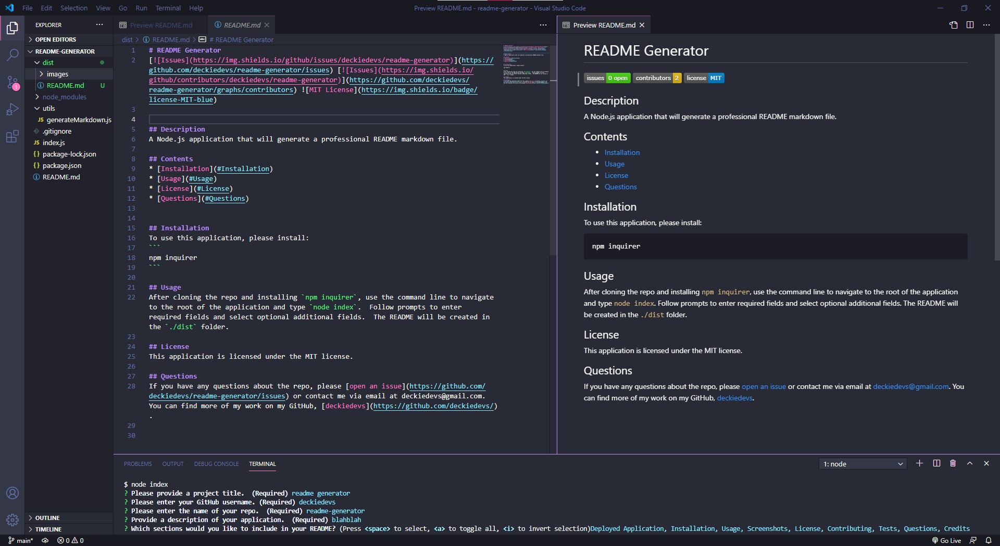

# README Generator
[](https://github.com/deckiedevs/readme-generator/issues) [](https://github.com/deckiedevs/readme-generator/graphs/contributors) 

  
## Description
A Node.js application that will generate a professional README markdown file.
            
View the deployed page at [README Generator](https://github.com/deckiedevs/readme-generator).
    
## Contents
* [Installation](#Installation)
* [Usage](#Usage)
   * [Screenshots](#Screenshots)
* [License](#License)
* [Contributing](#Contributing)
* [Tests](#Tests)
* [Questions](#Questions)
* [Credits](#Credits)

    
## Installation
To use this application, please install: 
```
npm inquirer
```
    
## Usage
After cloning the repo and installing `npm inquirer`, use the command line to navigate to the root of the application and type `node index`.  Follow prompts to enter required fields and select optional additional fields.  The README will be created in the `./dist` folder. 
    
### Screenshots

A screenshot of a sample README.

    
## License
This application is licensed under the MIT license.
    
## Contributing
There are no guidelines for contributing at this time.
    
## Tests
There are no tests for this application at this time.
    
## Questions
If you have any questions about the repo, please [open an issue](https://github.com/deckiedevs/readme-generator/issues) or contact me via email at deckiedevs@gmail.com. You can find more of my work on my GitHub, [deckiedevs](https://github.com/deckiedevs/).
    
## Credits
* [UCF Coding Boot Camp Starter Code](https://github.com/coding-boot-camp/potential-enigma)

    
